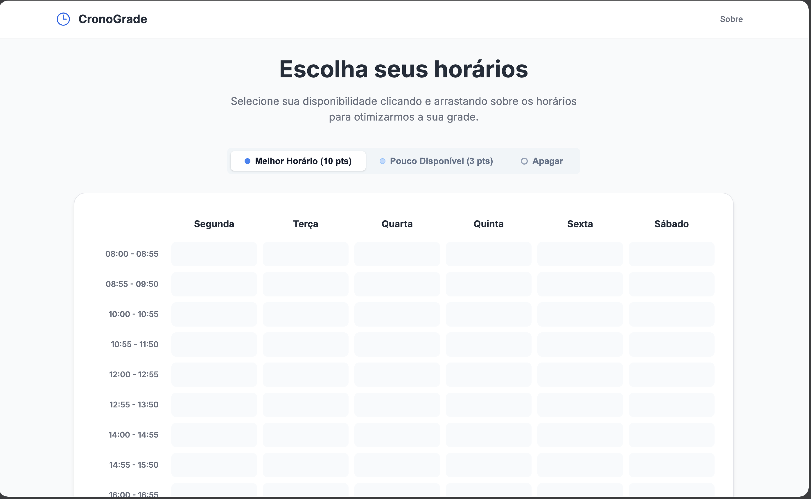
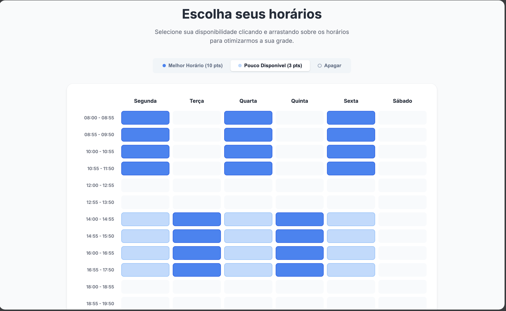
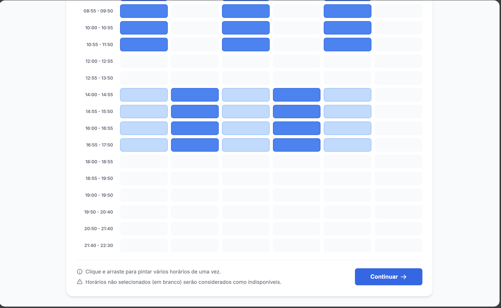
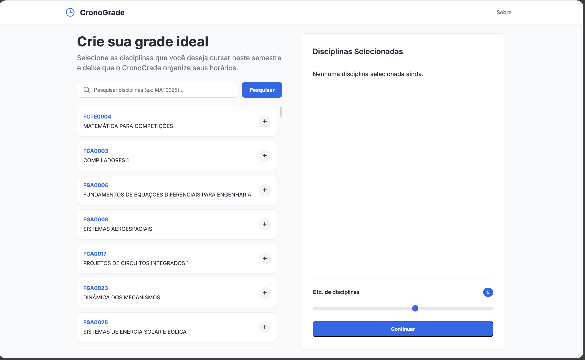
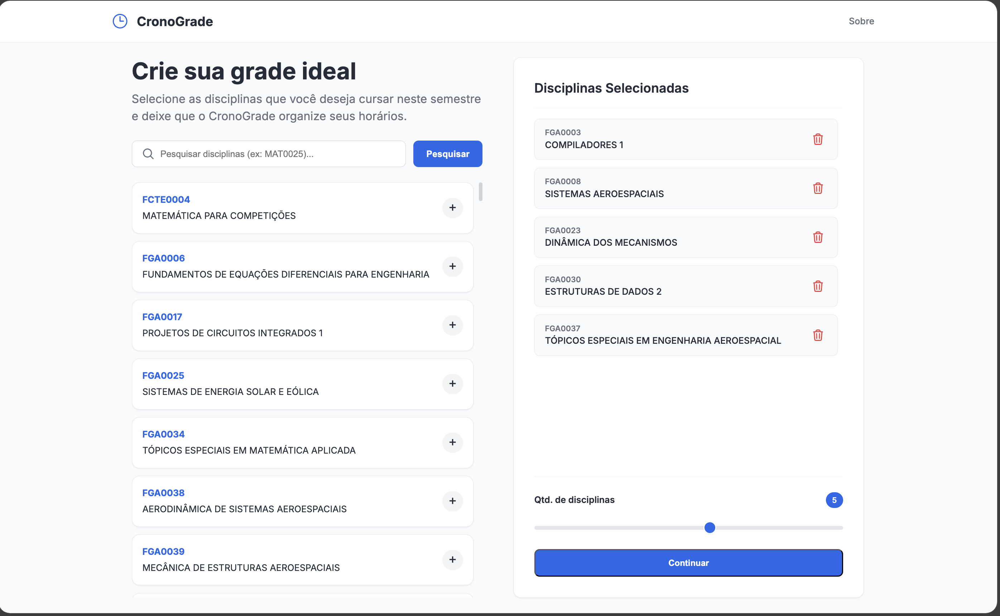
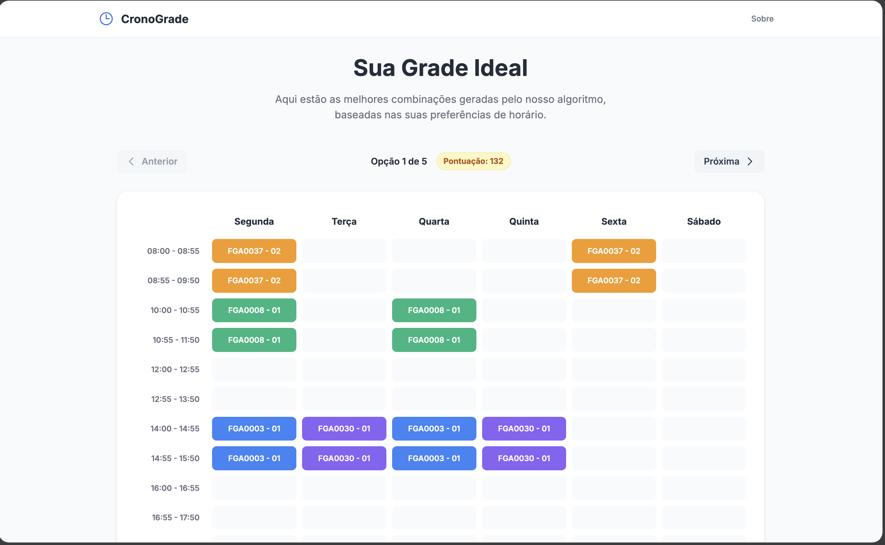
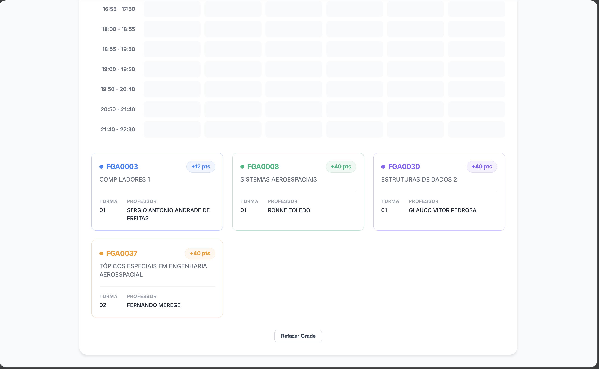

# CronoGrade

**Numero da Lista**: 15<br>
**Conteudo da Disciplina**: Grafos<br>

## Alunos

| Matricula | Aluno                          |
| --------- | ------------------------------ |
| 202017049 | Pedro Lucas Figueiredo Santana |
| 232014487 | Luiz Claudio Barbosa de Farias |

## Video de Apresentacao

[Assista no YouTube](https://youtu.be/Cx_KLjb9s7A)

## Sobre

O CronoGrade resolve o problema de montagem de grade horaria usando grafos. O aluno seleciona seus horarios disponiveis, escolhe as materias que quer cursar, e o sistema encontra as melhores combinacoes de turmas sem conflito.

### Modelagem em Grafos

O problema e modelado como um **Grafo de Compatibilidade** (representado por lista de adjacencia):

- **Vertices**: cada vertice e uma turma especifica (ex: Calculo 1 - Turma A) que cabe nos horarios do aluno.
- **Arestas**: uma aresta conecta duas turmas que sao **compativeis** entre si — ou seja, pertencem a materias diferentes e nao tem choque de horario.

### Algoritmo (DFS + Backtracking)

O objetivo e encontrar **Cliques** (subgrafos completos) no grafo de compatibilidade, com o tamanho exato da quantidade de materias que o aluno quer cursar. O processo funciona em 3 etapas:

1. **Filtragem e Pontuacao**: descarta turmas fora dos horarios disponiveis e atribui pontos a cada turma conforme a preferencia do aluno (Melhor Horario = 10 pts, Pouco Disponivel = 3 pts).
2. **DFS com Backtracking**: navega pelo grafo tentando construir combinacoes validas turma a turma, recuando quando encontra incompatibilidade ou percebe que nao vai atingir a quantidade desejada (poda).
3. **Ranking**: todas as grades validas encontradas sao ordenadas por pontuacao total (soma dos pesos dos horarios), retornando as melhores opcoes primeiro.

## Screenshots

### Tela Inicial


### Selecao de Horarios (Planner)




### Selecao de Materias



### Resultado



## Instalacao

**Linguagem**: Python<br>
**Framework**: Django<br>

```bash
# 1. Clone o repositorio
git clone git@github.com:projeto-de-algoritmos-2026/G15_Grafos_PA-26.1.git
cd G15_Grafos_PA-26.1

# 2. Crie e ative um ambiente virtual
python -m venv venv
source venv/bin/activate   # Linux/macOS
# venv\Scripts\activate    # Windows

# 3. Instale as dependencias
pip install -r requirements.txt

# 4. Aplique as migracoes e popule o banco
python manage.py migrate
python manage.py import_classes_data

# 5. Inicie o servidor
python manage.py runserver
```

## Uso

Acesse `http://127.0.0.1:8000/` no navegador.

1. Na tela inicial, clique em **"Comecar agora"**.
2. No **Planner**, marque seus horarios como "Melhor Horario" (10 pts) ou "Pouco Disponivel" (3 pts) arrastando sobre as celulas. Clique em "Continuar".
3. Na tela de **Materias**, busque e selecione as disciplinas desejadas. Ajuste a quantidade no slider e clique em "Continuar".
4. O sistema gera as grades e mostra o **Resultado** com a melhor opcao. Use as setas para navegar entre as opcoes ranqueadas.
5. A pagina **Sobre** (botao no menu) explica a modelagem e o algoritmo em detalhe.
